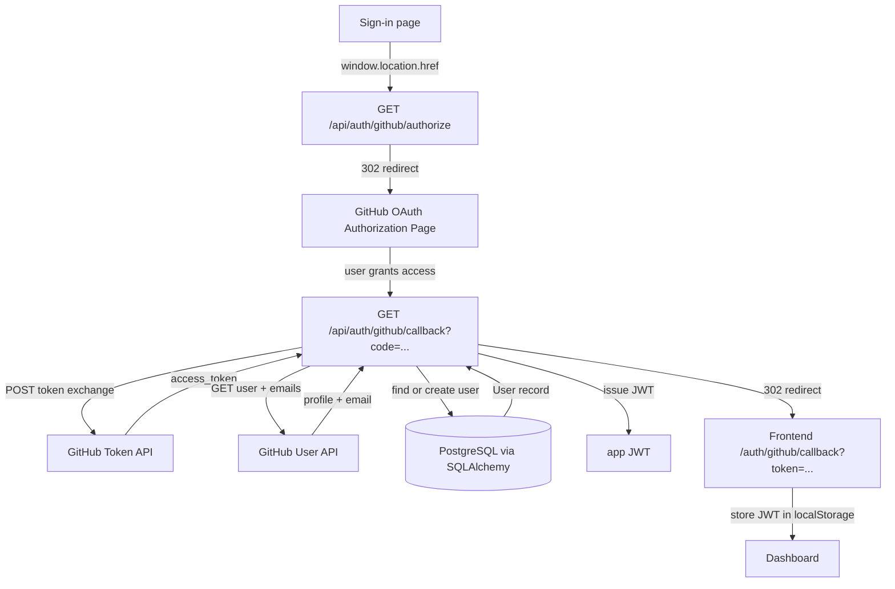
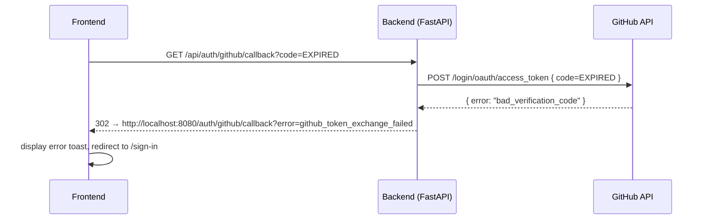

# Design Document: GitHub OAuth Authentication

## Overview

Add GitHub OAuth 2.0 sign-in to Quantum Studio, mirroring the existing Google OAuth pattern.
Because GitHub uses the authorization-code flow (not the implicit/ID-token flow that Google uses),
the backend acts as the OAuth client: it initiates the redirect, handles the callback, exchanges the
code for an access token, fetches the user's profile, and issues the app's own JWT before sending the
browser back to the frontend.

The frontend's only new responsibilities are (1) redirecting the browser to the backend's
`/api/auth/github/authorize` endpoint to start the flow, and (2) implementing the
`/_auth/auth/github/callback` route that receives the JWT from the query string, stores it, and
navigates to the dashboard — exactly the same pattern as the already-scaffolded
`frontend/src/routes/_auth/auth/github/callback.tsx` placeholder.

---

## Architecture



---

## Sequence Diagrams

### Happy Path

```mermaid
sequenceDiagram
    participant FE as Frontend
    participant BE as Backend (FastAPI)
    participant GH as GitHub API
    participant DB as PostgreSQL

    FE->>BE: window.location.href = /api/auth/github/authorize
    BE-->>FE: 302 → github.com/login/oauth/authorize?client_id=...
    FE->>GH: Browser follows redirect
    GH-->>FE: User grants; 302 → /api/auth/github/callback?code=ABC
    FE->>BE: GET /api/auth/github/callback?code=ABC
    BE->>GH: POST /login/oauth/access_token { code, client_id, client_secret }
    GH-->>BE: { access_token: "gho_..." }
    BE->>GH: GET /user  (Authorization: token gho_...)
    GH-->>BE: { id, login, name, email? }
    BE->>GH: GET /user/emails  (if primary email was null)
    GH-->>BE: [ { email, primary, verified } ]
    BE->>DB: SELECT user WHERE oauth_subject = github_id
    DB-->>BE: existing user OR null
    BE->>DB: INSERT or UPDATE user
    DB-->>BE: User record
    BE-->>FE: 302 → http://localhost:8080/auth/github/callback?token=JWT
    FE->>FE: store JWT in localStorage, navigate /dashboard
```

### Error Path (code exchange fails)



---

## Components and Interfaces

### Backend: `Settings` (config.py)

**New fields:**

```python
github_client_id: str = ""
github_client_secret: str = ""
frontend_url: str = "http://localhost:8080"
```

`frontend_url` is used to build the redirect URI after the callback so the backend never
hard-codes the frontend host.

---

### Backend: Auth Router — new endpoints (routers/auth.py)

#### `GET /api/auth/github/authorize`

Redirects the browser to GitHub's OAuth authorization page.

**Responsibilities:**
- Build the GitHub authorization URL with `client_id`, `redirect_uri`, `scope=user:email`
- Return HTTP 302 to GitHub

#### `GET /api/auth/github/callback`

Handles the callback from GitHub after user authorization.

**Responsibilities:**
- Exchange `code` query parameter for a GitHub access token via `httpx`
- Fetch the user's profile (`GET https://api.github.com/user`)
- Fetch verified primary email if not included in profile (`GET https://api.github.com/user/emails`)
- Find or create the local `User` record (same logic as Google handler)
- Issue a JWT with `create_access_token`
- Redirect to `{frontend_url}/auth/github/callback?token=JWT` on success
- Redirect to `{frontend_url}/auth/github/callback?error=<message>` on failure

**Data models (Pydantic schemas, internal):**

```python
class GitHubTokenResponse(BaseModel):
    access_token: str
    token_type: str
    scope: str

class GitHubUser(BaseModel):
    id: int
    login: str
    name: str | None
    email: str | None

class GitHubEmail(BaseModel):
    email: str
    primary: bool
    verified: bool
```

---

### Frontend: `backend.ts` — new helper

```typescript
export function initiateGithubLogin(): void {
  const backendUrl = (import.meta.env.VITE_BACKEND_URL ?? "http://localhost:5000").replace(/\/$/, "");
  window.location.href = `${backendUrl}/api/auth/github/authorize`;
}
```

No token exchange happens on the frontend; this is purely a redirect trigger.

---

### Frontend: `auth-context.tsx` — new method

```typescript
signInWithGitHub: () => void;
```

The method simply calls `initiateGithubLogin()`. It does **not** return a promise because control
leaves the SPA during the redirect flow.

```typescript
const signInWithGitHub = useCallback(() => {
  initiateGithubLogin();
}, []);
```

---

### Frontend: Sign-in page (`sign-in.tsx`)

Replace the `onClick={() => toast("Coming soon")}` on the `SocialButton` with:

```typescript
onClick={() => signInWithGitHub()}
```

Pull `signInWithGitHub` from `useAuth()`.

---

### Frontend: Callback route (`/_auth/auth/github/callback`)

The file `frontend/src/routes/_auth/auth/github/callback.tsx` already exists with a mostly-correct
implementation. The only fix required is changing the `from` argument in `useSearch` from
`"/_auth/auth/github/success"` (wrong route name) to `"/_auth/auth/github/callback"` (correct).

**Responsibilities:**
- Read `token` and `error` query params via `useSearch`
- On error: display toast, redirect to `/sign-in` after 2 s
- On success: store `token` in `localStorage` as `qs_token`, fetch `/api/auth/me` to cache
  `qs_user`, navigate to `/dashboard`

---

## Data Models

### User (existing — no schema change)

| Field | Type | Notes |
|---|---|---|
| `oauth_provider` | `str \| None` | Set to `"github"` |
| `oauth_subject` | `str \| None` | GitHub user ID (integer, stored as string) |
| `email` | `str` | Must be a verified primary GitHub email |
| `hashed_password` | `str` | Random token (same placeholder strategy as Google) |

The existing `User` model already supports GitHub — no migration needed.

---

## Error Handling

### Scenario 1: GitHub returns `bad_verification_code`

**Condition**: Code has expired or was already used.
**Response**: Backend redirects frontend to `?error=github_token_exchange_failed`.
**Recovery**: Frontend shows error toast and redirects to `/sign-in`.

### Scenario 2: GitHub user has no verified email

**Condition**: `GET /user` returns `email: null` and `GET /user/emails` returns no verified primary email.
**Response**: Backend redirects frontend to `?error=no_verified_email`.
**Recovery**: Frontend shows descriptive error toast.

### Scenario 3: GitHub credentials not configured

**Condition**: `settings.github_client_id` is empty string.
**Response**: `GET /api/auth/github/authorize` returns HTTP 500 with a JSON detail message.
**Recovery**: Developer must configure `GITHUB_CLIENT_ID` / `GITHUB_CLIENT_SECRET` in `.env`.

### Scenario 4: `httpx` network error to GitHub API

**Condition**: GitHub API is unreachable during code exchange or profile fetch.
**Response**: Exception caught, backend redirects to `?error=github_api_error`.
**Recovery**: Frontend shows error toast and redirects to `/sign-in`.

### Scenario 5: Existing user with different OAuth provider

**Condition**: Email already exists in DB with `oauth_provider = "google"`.
**Response**: Backend updates `oauth_provider` and `oauth_subject` to GitHub values and issues JWT
(same behavior as Google handler merging existing accounts).
**Recovery**: User is signed in seamlessly; prior provider association is overwritten.

---

## Testing Strategy

### Unit Testing Approach

- Test `_resolve_github_email()` helper: returns primary verified email, falls back to `/user/emails` endpoint, raises when none found.
- Test `_user_to_dict()` is unchanged and still works (no regression).
- Test `initiateGithubLogin()` sets `window.location.href` to the correct URL.

### Property-Based Testing Approach

**Property Test Library**: `hypothesis` (Python, backend) / `fast-check` (TypeScript, frontend)

See **Correctness Properties** section below.

### Integration Testing Approach

- Smoke test: `GET /api/auth/github/authorize` returns 302 when credentials are configured.
- Smoke test: `GET /api/auth/github/authorize` returns 500 when `github_client_id` is empty.

---

## Performance Considerations

The GitHub callback involves three sequential external HTTP calls (token exchange, profile, optional
emails). Using `httpx.AsyncClient` keeps the FastAPI event loop unblocked. No caching is needed
for the OAuth flow; the JWT caches identity on the client side as usual.

---

## Security Considerations

- `github_client_secret` is never exposed to the frontend; all GitHub API calls are backend-only.
- The `code` grant is single-use; replayed codes are rejected by GitHub automatically.
- The JWT issued is identical in structure and expiry to those issued by Google and password login —
  no new attack surface.
- `frontend_url` must be restricted to known origins in production (configured via env var, not
  hard-coded).
- The `scope` is limited to `user:email` — the minimum needed to obtain a verified email address.

---

## Dependencies

| Component | Dependency | Already present? |
|---|---|---|
| Backend HTTP client | `httpx` | Yes (ships with FastAPI ecosystem) |
| Frontend redirect | `window.location.href` | Yes (native browser API) |
| JWT issuing | `python-jose` via `app.auth.create_access_token` | Yes |
| DB access | `sqlalchemy` async session | Yes |
| Settings | `pydantic-settings` | Yes |

No new packages required.

---

## Correctness Properties

*A property is a characteristic or behavior that should hold true across all valid executions of a
system — essentially, a formal statement about what the system should do.*

### Property 1: Email resolution selects the correct verified primary email

For any list of GitHub email objects (with varying combinations of `primary` and `verified` flags),
the email-resolution helper SHALL return the email address that has both `primary = true` and
`verified = true`, and SHALL signal an error when no such entry exists.

**Validates: Requirements 2.5, 2.6**

### Property 2: User find-or-create idempotency

For any GitHub user profile (any user ID, login, and email combination), invoking the
find-or-create logic twice in succession SHALL produce exactly one `User` row in the database with
`oauth_provider = "github"` and `oauth_subject` equal to the string representation of the GitHub
user ID.

**Validates: Requirements 2.7, 2.8, 2.9, 2.10**

### Property 3: JWT round-trip — token issued is verifiable

For any `User` record persisted by the callback handler, the JWT issued by `create_access_token`
SHALL decode (using the app's `SECRET_KEY` and `ALGORITHM`) to a payload whose `sub` field equals
the `User.id` of that record.

**Validates: Requirements 2.11**

### Property 4: Success redirect always embeds the issued JWT verbatim

For any JWT string produced by the callback handler, the HTTP 302 `Location` header SHALL be
`{frontend_url}/auth/github/callback?token={jwt}` with the token value unchanged.

**Validates: Requirements 2.12**

### Property 5: Frontend callback stores exactly the token from the URL

For any non-empty token string `T` passed as `?token=T` to the `Frontend_Callback_Route`, after
the route's `useEffect` settles, `localStorage.getItem("qs_token")` SHALL equal `T`.

**Validates: Requirements 3.1**

### Property 6: `initiateGithubLogin` constructs the correct authorize URL

For any value of `VITE_BACKEND_URL` (with or without a trailing slash), calling
`initiateGithubLogin()` SHALL set `window.location.href` to
`{VITE_BACKEND_URL_stripped}/api/auth/github/authorize`.

**Validates: Requirements 4.2, 4.3**
